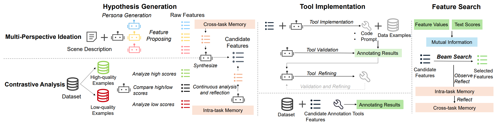

# 🤖 AutoQual
AutoQual: An LLM Agent for Automated Discovery of Interpretable Features for Review Quality Assessment

# 📰 News
- **2025.09** Our paper, "AutoQual: An LLM Agent for Automated Discovery of Interpretable Features for Review Quality Assessment," has been accepted by EMNLP 2025!

# 🌍 Introduction
Ranking online reviews by their intrinsic quality is a critical task for e-commerce platforms and information services, impacting user experience and business outcomes. However, quality is a domain-dependent and dynamic concept, making its assessment a formidable challenge. Traditional methods relying on hand-crafted features are unscalable across domains and fail to adapt to evolving content patterns, while modern deep learning approaches often produce black-box models that lack interpretability.

To address these challenges, we propose **AutoQual**, an LLM-based agent framework that automates the discovery of interpretable features. While demonstrated on review quality assessment, AutoQual is designed as a general framework for transforming tacit knowledge embedded in data into explicit, computable features. It mimics a human research process, iteratively generating feature hypotheses through reflection, operationalizing them via autonomous tool implementation, and accumulating experience in a persistent memory.



# ⌨️ Repo Structure
```
- main.py                       # Main entry point for the AutoQual agent
- config.py                     # Configuration settings (API keys, parameters, paths)
- llm_provider.py               # LLM interface wrapper for HP and GP models
- prompts.py                    # All prompt templates for LLM interactions
- feature_generator.py          # Initial feature pool generation module
- tool_generator.py             # Annotation tool generation (CODE/PROMPT)
- annotator.py                  # Feature annotation orchestration
- feature_selector.py           # Feature selection using beam search
- data/                         # Data directory (see Data Preparation below)
- README.md                     # This file
```

# 💡 Running Experiments

## Installation
It is recommended to use Conda to manage the environment.
```bash
conda create -n autoqual python=3.10
conda activate autoqual
pip install pandas openai tqdm scikit-learn xgboost scipy
```

## API Keys
Configure your API keys in `config.py`:
```python
# High-Performance Model (for generation, reflection)
HP_API_KEY = "your-deepseek-api-key"
HP_BASE_URL = "https://api.deepseek.com"
HP_MODEL_NAME = "deepseek-reasoner"

# General-Purpose Model (for annotation, simple tasks)
GP_API_KEY = "your-qwen-api-key"
GP_BASE_URL = "https://dashscope.aliyuncs.com/compatible-mode/v1"
GP_MODEL_NAME = "qwen-plus-latest"
```

## Data Preparation
Your data directory should contain:
- `scene_description.txt` - Text describing the evaluation scenario
- `*.csv` - CSV file with `text` and `score` columns

Example structure:
```
data/
  └── Amazon_clothing/
      ├── scene_description.txt
      └── Clothing_Shoes_and_Jewelry_2000.csv
```

**CSV Format**:
The CSV file must contain at least two columns:
- `text`: Review text to be evaluated
- `score`: Quality score (e.g., helpfulness votes, click-through rate)

**Scene Description Example**:
```
This task aims to assess the quality of clothing and fashion product reviews 
on e-commerce platforms. High-quality reviews should provide detailed 
descriptions of fit, material, sizing accuracy, and styling suggestions.
```

## Running

### Basic Usage
Run with default settings from `config.py`:
```bash
python main.py
```

Specify a different scene:
```bash
python main.py --scene Amazon_grocery
```

### Execution Modes
AutoQual supports two execution modes (configured in `config.py`):

**Manual Mode** (recommended for first-time users):
```python
EXECUTION_MODE = 'manual'
```
- The system pauses after each major stage
- Allows you to review and modify intermediate results
- Provides better understanding of the agent's workflow

**Auto Mode** (for batch experiments):
```python
EXECUTION_MODE = 'auto'
```
- Runs end-to-end without interruption
- Suitable for large-scale experiments

### The 6-Stage Pipeline

AutoQual discovers interpretable features through a systematic 6-stage pipeline:

**Stage 1: Role Generation**
- The LLM generates diverse expert personas based on the scenario
- Each role represents a unique perspective on quality assessment
- Output: `output/{scene}/01_generated_roles.txt`

**Stage 2: Feature Generation (Parallel)**
- **Role-based features**: Each expert role proposes quality features
  - Outputs: `02_role_1_features.txt`, `02_role_2_features.txt`, ...
- **Data-based features**: Analyze actual review samples
  - Positive sample analysis: `03_data_positive_features.txt`
  - Negative sample analysis: `04_data_negative_features.txt`
  - Contrastive analysis: `05_data_contrastive_features.txt`

**Stage 3: Feature Integration**
- Merges, deduplicates, and refines all generated features
- Output: `06_integrated_features.txt`

**Stage 4: Tool Assignment**
- Determines annotation tool type (CODE or PROMPT) for each feature
- Output: `07_tool_type_assignments.csv`

**Stage 5: Tool Generation (Parallel)**
- CODE tools: Python functions for rule-based features
  - Outputs: `tools/code/*.py`
- PROMPT tools: LLM prompts for semantic features
  - Outputs: `tools/prompts/*.txt`

**Stage 6: Feature Annotation**
- Applies all tools to the dataset
- Two-stage process:
  1. Fast CODE-based annotation
  2. Parallel PROMPT-based annotation with checkpointing
- Outputs: `final_annotated_data.csv`

**Feature Selection**
- Uses beam search to find optimal feature subset
- Evaluation methods: Mutual Information, Linear Regression, or XGBoost
- Outputs: `best_features.txt`, `train_data.csv`, `test_data.csv`

### Iterative Optimization (Optional)

Enable iterative refinement in `config.py`:
```python
ITERATION_EPOCHS = 3  # Number of reflection-optimization cycles
```

The agent will:
1. **Reflect**: Analyze current features and identify gaps
2. **Generate**: Propose new features to address gaps
3. **Implement**: Create annotation tools for new features
4. **Re-annotate**: Apply new tools to the dataset
5. **Re-select**: Find optimal features from expanded pool

Iteration outputs: `epoch_*_best_features.txt`, `08_epoch*_reflected_features.txt`

## Configuration

Key parameters in `config.py`:

### Feature Generation
```python
ROLE_COUNT = 3                      # Number of evaluator roles
SAMPLE_COUNT = 20                   # High/low score samples for analysis
FEATURE_COUNT_PER_ROLE = 3          # Features generated per role
FEATURE_COUNT_POSITIVE = 3          # Features from positive samples
FEATURE_COUNT_NEGATIVE = 3          # Features from negative samples
FEATURE_COUNT_CONTRASTIVE = 10      # Features from contrastive analysis
```

### Feature Selection
```python
EVALUATION_METHOD = "linear_regression"  # Options: "mutual_information", "linear_regression", "xgboost"
BEAM_WIDTH = 10                          # Beam search width
MAX_FEATURES = 10                        # Maximum features to select
TEST_SIZE = 0.2                          # Train/test split ratio
```

### Annotation
```python
ANNOTATION_MAX_WORKERS = 50              # Parallel workers for prompt annotation
ANNOTATION_CHECKPOINT_INTERVAL = 100     # Save checkpoint every N rows
```

### Iterative Optimization
```python
ITERATION_EPOCHS = 0                     # Number of optimization cycles
NEW_FEATURES_PER_EPOCH = 3               # New features per iteration
```

## Output Files

All results are saved in `output/{SCENE_NAME}/`:

**Feature Discovery Files**:
- `01_generated_roles.txt` - Generated evaluator roles
- `02_role_*_features.txt` - Features from each role
- `03_data_positive_features.txt` - Features from high-quality samples
- `04_data_negative_features.txt` - Features from low-quality samples
- `05_data_contrastive_features.txt` - Features from contrastive analysis
- `06_integrated_features.txt` - Merged and refined feature pool

**Tool Files**:
- `07_tool_type_assignments.csv` - Tool type (CODE/PROMPT) for each feature
- `tools/code/*.py` - Python functions for rule-based features
- `tools/prompts/*.txt` - LLM prompts for semantic features

**Data Files**:
- `train_data.csv` - Training set with feature annotations
- `test_data.csv` - Test set with feature annotations
- `intermediate_code_annotated.csv` - After CODE annotation
- `final_annotated_data.csv` - After full annotation
- `checkpoint_annotated_data.csv` - Intermediate checkpoint (if interrupted)

**Selection Results**:
- `best_features.txt` - Selected optimal features
- `epoch_0_best_features.txt` - Initial selection results
- `epoch_*_best_features.txt` - Results from each iteration (if enabled)
- `08_epoch*_reflected_features.txt` - Reflected features per iteration (if enabled)

# 🔬 Key Features

- **🤖 Autonomous Agent**: Mimics human research process with reflection and memory
- **🔍 Interpretable Features**: Discovers human-understandable quality indicators
- **⚡ Multi-Perspective Generation**: Combines role-based and data-driven approaches
- **🛠️ Flexible Tools**: Supports both code-based and LLM-based annotation
- **🔄 Iterative Refinement**: Continuously improves through reflection (optional)
- **💾 Efficient Annotation**: Parallel processing with checkpointing

# 📊 Performance Highlights

- **Better than Fine-tuned PLMs**: Outperforms BERT-based models on review quality assessment
- **Domain-Specific Discovery**: Automatically finds interpretable, domain-relevant features
- **Cross-Domain Generalization**: Works on persuasiveness, essay scoring, toxicity detection
- **Transparent and Actionable**: Features are interpretable and can guide content creators

# 🔧 Advanced Usage

## Custom Evaluation Methods
Choose the feature evaluation method that best suits your task:
- **`mutual_information`**: Fast, works well for individual feature importance
- **`linear_regression`**: Balanced approach, uses Spearman's Rho correlation
- **`xgboost`**: More powerful, captures non-linear feature interactions

Example in `config.py`:
```python
EVALUATION_METHOD = "xgboost"  # For complex relationships
```

## Customizing for Your Domain

1. **Prepare Your Data**:
   - Create a scene directory under `data/`
   - Write a detailed `scene_description.txt` explaining quality criteria
   - Prepare a CSV with `text` and `score` columns

2. **Adjust Generation Parameters**:
   - Increase `ROLE_COUNT` for more diverse perspectives
   - Increase `SAMPLE_COUNT` for better data-driven features
   - Adjust feature counts per generation type based on domain complexity

3. **Run in Manual Mode First**:
   - Review generated roles and features
   - Refine scene description if needed
   - Verify tool assignments (CODE vs PROMPT)

4. **Iterate and Refine**:
   - Enable `ITERATION_EPOCHS` for continuous improvement
   - Monitor feature scores to understand what works
   - Use insights to refine your scene description

---

# 🌟 Citation

If you find this work helpful, please cite our paper:

```bibtex
@inproceedings{lan2025autoqual,
  title={AutoQual: An LLM Agent for Automated Discovery of Interpretable Features for Review Quality Assessment},
  author={Lan, Xiaochong and Feng, Jie and Liu, Yinxing and Shi, Xinlei and Li, Yong},
  booktitle={Proceedings of the 2025 Conference on Empirical Methods in Natural Language Processing},
  year={2025},
  organization={Association for Computational Linguistics}
}
```

# 📩 Contact

If you have any questions or want to use the code, feel free to contact:

**Xiaochong Lan** (lanxc22@mails.tsinghua.edu.cn)
